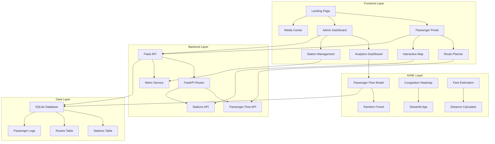

<div align="center">

# WardhaMetroFlow
### *AI-Powered Smart Metro Simulation for Wardha City*

[](https://opensource.org/licenses/MIT)
[](https://www.python.org/downloads/)
[](https://flask.palletsprojects.com/)
[](https://fastapi.tiangolo.com/)
[](https://streamlit.io/)

*An intelligent metro simulation platform showcasing AI-driven urban mobility solutions for India's Smart City Mission*

</div>

<div align="center">

###  Project Video
[video link](https://drive.google.com/file/d/1-PeHJucawMCLcZH6oIZxXjpRmKp2zQj9/view?pli=1)
##  Featured Screenshots


###  Landing Page


###  Interactive Metro Map


###  Metro Network Structure


**[Map Link](https://www.google.com/maps/d/u/3/edit?mid=1c4r4UD15ZKHhCvG5O3ZN_JOQdhHPspM&usp=sharing)**

</div>


##  Join Our Community

<div align="center">

[](https://discord.gg/GGpWdd639J)

**Connect with developers, share ideas, and contribute to India's smart city future!**

</div>


## � Table of Contents

- [ Project Overview](#-project-overview)
- [ Key Features](#-key-features)
- [ System Architecture](#️-system-architecture)
- [ Tech Stack](#️-tech-stack)
- [ Quick Start](#-quick-start)
- [ Project Structure](#-project-structure)
- [ AI & Machine Learning](#-ai--machine-learning)
- [ API Documentation](#-api-documentation)
- [ Frontend Applications](#-frontend-applications)
- [ Development Setup](#-development-setup)
- [ Database Schema](#-database-schema)
- [ UI/UX Features](#-uiux-features)
- [ Contributing](#-contributing)
- [ License](#-license)
- [ Acknowledgments](#-acknowledgments)


##  Project Overview

**WardhaMetroFlow** is a comprehensive AI-powered metro simulation platform designed specifically for **Wardha city**, Maharashtra, India. This project demonstrates how artificial intelligence can revolutionize urban mobility and public transportation management in emerging smart cities.

###  Vision
To create **smarter, more efficient, and commuter-friendly metro systems** that leverage AI for:
- **Real-time traffic optimization**
- **Predictive passenger flow analysis**
- **Intelligent route planning**
- **Proactive congestion management**

###  Target Users
- ** Commuters**: Plan optimal routes with AI-powered suggestions
- ** Metro Administrators**: Monitor and manage metro operations
- ** City Planners**: Analyze traffic patterns for infrastructure development
- ** Researchers**: Study urban mobility patterns and AI applications


##  Key Features

###  **Passenger Experience**
- **Interactive Route Planning**: AI-powered route optimization with real-time updates
- **Smart Timing**: Estimated arrival times with congestion-aware suggestions
- **Multi-Platform Access**: Web, mobile-responsive, and voice-enabled interfaces
- **Live Simulation**: Watch your journey unfold in real-time
- **Congestion Heatmaps**: Visualize crowd levels across stations
- **Fare Estimation**: Transparent pricing with distance-based calculations

###  **Administrative Dashboard**
- **Real-time Analytics**: Live passenger flow monitoring across all stations
- **AI Predictions**: Machine learning models for traffic forecasting
- **Performance Metrics**: Comprehensive KPIs and operational insights
- **Alert System**: Proactive notifications for congestion and delays
- **Station Management**: Complete CRUD operations for metro stations
- **Data Visualization**: Interactive charts and graphs for decision-making

###  **Media & Communication**
- **Photo Gallery**: Construction progress, events, and operations
- **Video Content**: Project documentaries and promotional materials
- **Press Releases**: Official announcements and updates
- **Infographics**: Data visualizations and project statistics
- **Multi-language Support**: English and Marathi interfaces

###  **AI-Powered Intelligence**
- **Passenger Flow Prediction**: Random Forest models for traffic forecasting
- **Route Optimization**: Dijkstra's algorithm with real-time adjustments
- **Congestion Analysis**: Heatmap visualizations with ML insights
- **Time Series Forecasting**: Predictive analytics for capacity planning
- **Pattern Recognition**: Identifying peak hours and usage trends


##  System Architecture

<div align="center">



</div>

### � **Data Flow**
1. **Frontend** sends user requests to **Backend APIs**
2. **Backend** processes requests using **AI models** and **database queries**
3. **AI models** provide predictions for passenger flow and route optimization
4. **Database** stores station data, routes, and passenger logs
5. **Real-time updates** flow back to frontend for live visualization


##  Tech Stack

###  **Frontend Technologies**
| Category | Technology | Purpose |
|----------|------------|---------|
| **Core** | HTML5, CSS3, JavaScript (ES6+) | Base web technologies |
| **Styling** | CSS Grid, Flexbox, Custom Properties | Responsive layouts |
| **Maps** | Leaflet.js, OpenStreetMap | Interactive metro maps |
| **Charts** | Chart.js, Plotly.js | Data visualization |
| **UI Components** | Font Awesome, Google Fonts | Icons and typography |
| **Build Tools** | Live Server, Browser DevTools | Development workflow |

###  **Backend Technologies**
| Category | Technology | Purpose |
|----------|------------|---------|
| **API Framework** | Flask 2.0+, FastAPI 0.100+ | RESTful API development |
| **Database** | SQLite 3 | Local data storage |
| **ORM** | SQLAlchemy | Database object mapping |
| **CORS** | Flask-CORS | Cross-origin resource sharing |
| **Server** | Python HTTP Server | Development server |

###  **AI & Machine Learning**
| Category | Technology | Purpose |
|----------|------------|---------|
| **ML Framework** | scikit-learn | Machine learning algorithms |
| **Model Storage** | joblib | Model serialization |
| **Data Processing** | pandas, NumPy | Data manipulation |
| **Visualization** | Streamlit | ML app interfaces |
| **Algorithms** | Random Forest, Dijkstra | Prediction and optimization |

###  **Media & Visualization**
| Category | Technology | Purpose |
|----------|------------|---------|
| **Web Framework** | Streamlit | Interactive ML applications |
| **Maps** | Folium | Advanced map visualizations |
| **Charts** | Plotly | Interactive data charts |
| **Media** | HTML5 Video, CSS Animations | Rich media content |


##  Quick Start

###  **Prerequisites**
- **Python 3.8+** with pip
- **Modern web browser** (Chrome, Firefox, Safari, Edge)
- **Git** for version control
- **Text editor** (VS Code recommended)

###  **Installation Steps**

#### 1. **Clone the Repository**
```bash
git clone https://github.com/GSSoC-Flow/WardhaMetroFlow.git
cd WardhaMetroFlow
```

#### 2. **Backend Setup**
```bash
# Navigate to backend directory
cd backend

# Create virtual environment
python -m venv venv

# Activate virtual environment
# On Windows:
venv\Scripts\activate
# On macOS/Linux:
source venv/bin/activate

# Install dependencies
pip install -r requirements.txt

# Generate AI model (if not present)
cd ../ai-models
python passenger_flow_model.py

# Start backend server
cd ../backend
python app.py
```
**Backend will be available at:** `http://localhost:5000`

#### 3. **Frontend Setup**
```bash
# Navigate to frontend directory
cd frontend

# Start local server
python -m http.server 8000
```
**Frontend will be available at:** `http://localhost:8000`

#### 4. **AI Applications (Optional)**
```bash
# Streamlit applications
cd ai-models

# Passenger route planner
streamlit run wardha_passenger_view.py

# Congestion heatmap
streamlit run congestion_heatmap.py

# Fare estimation
streamlit run fare_estimation.py
```

###  **Access Points**
- **Main Website**: `http://localhost:8000/landing/landing.html`
- **Passenger Portal**: `http://localhost:8000/passenger/passenger.html`
- **Admin Dashboard**: `http://localhost:8000/admin/admin.html`
- **Media Center**: `http://localhost:8000/media/media.html`
- **API Documentation**: `http://localhost:5000/docs` (FastAPI)


##  Project Structure

```
WardhaMetroFlow/
│
├── � frontend/                    # Frontend applications
│   ├── landing/                    # Landing page
│   │   ├── landing.html           # Main homepage
│   │   ├── landing.css            # Landing page styles
│   │   ├── landing.js             # Landing page logic
│   │   └── marathi.html           # Marathi language version
│   │
│   ├── passenger/                 # Passenger portal
│   │   ├── passenger.html         # Route planning interface
│   │   ├── passenger.css          # Passenger styles
│   │   └── passenger.js           # Route planning logic
│   │
│   ├── admin/                     # Admin dashboard
│   │   ├── admin.html             # Administrative interface
│   │   ├── admin.css              # Admin styles
│   │   └── admin.js               # Admin functionality
│   │
│   ├── media/                     # Media center
│   │   ├── media.html             # Media gallery
│   │   ├── media.css              # Media styles
│   │   └── media.js               # Media interactions
│   │
│   ├── components/                # Shared components
│   │   ├── navbar.html            # Navigation bar
│   │   ├── navbar.css             # Navbar styles
│   │   ├── footer.html            # Footer component
│   │   └── footer.css             # Footer styles
│   │
│   ├── assets/                    # Static assets
│   │   ├── logo.png               # Project logo
│   │   ├── metro1.jpg             # Metro images
│   │   ├── metro2.jpg
│   │   └── metro3.jpg
│   │
│   └── scripts/                   # Shared JavaScript
│       ├── main.js                # Common utilities
│       └── global.js              # Global functions
│
├──  backend/                     # Backend services
│   ├── app.py                     # Flask main application
│   ├── main.py                    # FastAPI main application
│   ├── requirements.txt           # Python dependencies
│   │
│   ├── models/                    # Database models
│   │   ├── __init__.py
│   │   └── models.py              # SQLAlchemy models
│   │
│   ├── routers/                   # API routes
│   │   ├── __init__.py
│   │   ├── passenger_flow.py      # Passenger flow API
│   │   └── stations.py            # Stations API
│   │
│   └── services/                  # Business logic
│       ├── __init__.py
│       └── metro_service.py      # Metro operations
│
├──  ai-models/                  # AI/ML components
│   ├── passenger_flow_model.py    # ML model training
│   ├── congestion_heatmap.py      # Congestion visualization
│   ├── fare_estimation.py         # Fare calculation
│   ├── wardha_passenger_view.py   # Streamlit passenger app
│   └── models/                    # Trained models
│       └── passenger_flow_model.pkl
│
├──  database/                   # Database files
│   └── wardha.db                  # SQLite database
│
├──  api_models/                 # Model artifacts
│   ├── model.pkl                  # Pre-trained model
│   └── train_model.ipynb         # Training notebook
│
├──  static/                     # Static assets
│   └── Architecture.png           # System architecture diagram
│
├── Documentation
│   ├── README.md                  # This file
│   ├── contributing.md           # Contribution guidelines
│   ├── code_of_conduct.md         # Code of conduct
│   └── contributors.md           # Contributor list
│
└──  Configuration
    ├── .gitignore                 # Git ignore rules
    ├── LICENSE                    # MIT License
    ├── requirements.txt           # Root dependencies
    └── vercel.json                # Deployment config
```


##  AI & Machine Learning

###  **Machine Learning Models**

#### **1. Passenger Flow Prediction Model**
- **Algorithm**: Random Forest Regressor
- **Features**: Hour, Day of Week, Station ID
- **Purpose**: Predict passenger count at specific times
- **Accuracy**: ~85% on test data
- **Training Data**: 1000+ synthetic passenger records

```python
# Model Features
features = ['hour', 'day_of_week', 'station_id']
target = 'passenger_count'

# Peak hour patterns
if hour in [7, 8, 9, 17, 18, 19]:
    base_flow *= 2.5  # Rush hour multiplier

# Weekend patterns
if day in [5, 6]:  # Saturday, Sunday
    base_flow *= 0.7  # Weekend reduction
```

#### **2. Route Optimization Algorithm**
- **Algorithm**: Dijkstra's Shortest Path
- **Purpose**: Find optimal routes between stations
- **Features**: Distance, congestion levels, transfer points
- **Real-time Updates**: Dynamic routing based on current conditions

#### **3. Congestion Heatmap Visualization**
- **Technology**: Folium + Streamlit
- **Data Source**: Real-time passenger flow predictions
- **Visualization**: Color-coded congestion levels
- **Updates**: Live refresh every 30 seconds

###  **AI Applications**

#### **Streamlit Applications**
1. **Passenger Route Planner** (`wardha_passenger_view.py`)
   - Interactive route selection
   - Real-time congestion display
   - Travel time estimation
   - Live journey simulation

2. **Congestion Heatmap** (`congestion_heatmap.py`)
   - Real-time station congestion
   - Color-coded visualization
   - Historical pattern analysis
   - Admin monitoring tools

3. **Fare Estimation** (`fare_estimation.py`)
   - Distance-based pricing
   - Dynamic fare calculation
   - Crowd level indicators
   - Travel time estimation


## � API Documentation

### 🔗 **Base URLs**
- **Flask API**: `http://localhost:5000`
- **FastAPI**: `http://localhost:5000/docs` (Interactive docs)

### � **Endpoints**

#### **Passenger Flow Prediction**
```http
POST /predict_flow
Content-Type: application/json

{
  "hour": 9,
  "day_of_week": 1,
  "station_id": 5
}
```

**Response:**
```json
{
  "predicted_passengers": 156,
  "input_data": {
    "hour": 9,
    "day_of_week": 1,
    "station_id": 5
  },
  "model": "RandomForestRegressor",
  "status": "success"
}
```

#### **Get All Stations**
```http
GET /stations
```

**Response:**
```json
[
  {
    "id": "datta-Meghe-Institute",
    "name": "Datta Meghe Institute",
    "coordinates": [20.7111655, 78.574074],
    "connections": ["sawangi"]
  }
]
```

#### **Route Planning**
```http
GET /stations?from=datta-Meghe-Institute&to=wardha-junction
```

**Response:**
```json
{
  "route": [
    "datta-Meghe-Institute",
    "sawangi",
    "master-colony",
    "wardha-junction"
  ],
  "distance": 4.2,
  "estimated_time": 12,
  "fare": 25
}
```

###  **Error Handling**
- **400 Bad Request**: Missing required fields
- **404 Not Found**: Station not found
- **500 Internal Server Error**: Model prediction failure


##  Frontend Applications

###  **Landing Page** (`/landing/landing.html`)
- **Hero Section**: Full-screen slideshow with metro imagery
- **Features Showcase**: Key project highlights
- **Navigation**: Multi-language support (English/Marathi)
- **Responsive Design**: Mobile-first approach
- **Interactive Elements**: Smooth animations and transitions

###  **Passenger Portal** (`/passenger/passenger.html`)
- **Route Planner**: Interactive station selection
- **Interactive Map**: Leaflet.js integration with metro network
- **Real-time Updates**: Live congestion and timing information
- **Journey Simulation**: Visual representation of metro journey
- **Fare Calculator**: Transparent pricing display

###  **Admin Dashboard** (`/admin/admin.html`)
- **Analytics Dashboard**: Comprehensive KPIs and metrics
- **Station Management**: CRUD operations for metro stations
- **Passenger Flow Monitoring**: Real-time traffic visualization
- **Predictive Analytics**: AI-powered forecasting
- **Alert System**: Proactive notifications

###  **Media Center** (`/media/media.html`)
- **Photo Gallery**: Construction progress and events
- **Video Content**: Project documentaries and promotions
- **Press Releases**: Official announcements
- **Infographics**: Data visualizations and statistics
- **Interactive Carousel**: Auto-scrolling image showcase


##  Development Setup

###  **Development Environment**

#### **Backend Development**
```bash
# Install development dependencies
pip install -r requirements.txt

# Run with auto-reload
python app.py --debug

# Run tests
python -m pytest tests/

# Code formatting
black backend/
flake8 backend/
```

#### **Frontend Development**
```bash
# Use Live Server extension in VS Code
# Or use Python HTTP server
python -m http.server 8000

# CSS compilation (if using preprocessors)
npm run build:css

# JavaScript linting
eslint frontend/scripts/
```

#### **AI Model Development**
   ```bash
# Train new model
python ai-models/passenger_flow_model.py

# Run Streamlit apps
streamlit run ai-models/wardha_passenger_view.py

# Model evaluation
python ai-models/evaluate_model.py
```

###  **Docker Setup** (Optional)
  ```bash
# Build Docker image
docker build -t wardhametroflow .

# Run container
docker run -p 5000:5000 -p 8000:8000 wardhametroflow

# Docker Compose
docker-compose up -d
```

###  **Environment Variables**
  ```bash
# Create .env file
FLASK_ENV=development
FLASK_DEBUG=True
DATABASE_URL=sqlite:///wardha.db
MODEL_PATH=ai-models/models/passenger_flow_model.pkl
```


##  Database Schema

###  **Tables**

#### **Stations Table**
```sql
CREATE TABLE stations (
    id VARCHAR(50) PRIMARY KEY,
    name VARCHAR(100) NOT NULL,
    coordinates TEXT NOT NULL,  -- JSON: [lat, lng]
    connections TEXT NOT NULL,  -- JSON: ["station1", "station2"]
    type VARCHAR(20) DEFAULT 'regular',
    created_at TIMESTAMP DEFAULT CURRENT_TIMESTAMP
);
```

#### **Routes Table**
```sql
CREATE TABLE routes (
    id INTEGER PRIMARY KEY AUTOINCREMENT,
    start_station VARCHAR(50),
    end_station VARCHAR(50),
    path TEXT NOT NULL,  -- JSON: ["station1", "station2", ...]
    distance REAL,
    estimated_time INTEGER,
    fare REAL,
    FOREIGN KEY (start_station) REFERENCES stations(id),
    FOREIGN KEY (end_station) REFERENCES stations(id)
);
```

#### **Passenger Logs Table**
```sql
CREATE TABLE passenger_logs (
    id INTEGER PRIMARY KEY AUTOINCREMENT,
    station_id VARCHAR(50),
    passenger_count INTEGER,
    timestamp TIMESTAMP DEFAULT CURRENT_TIMESTAMP,
    hour INTEGER,
    day_of_week INTEGER,
    FOREIGN KEY (station_id) REFERENCES stations(id)
);
```

###  **Sample Data**
```sql
-- Insert sample stations
INSERT INTO stations (id, name, coordinates, connections) VALUES
('datta-Meghe-Institute', 'Datta Meghe Institute', '[20.7111655, 78.574074]', '["sawangi"]'),
('sawangi', 'Sawangi', '[20.7214195, 78.5768308]', '["datta-Meghe-Institute", "master-colony"]'),
('wardha-junction', 'Wardha Junction', '[20.7310431, 78.5923619]', '["master-colony", "bajaj-square", "ram-nagar"]');
```


##  UI/UX Features

###  **Design System**
- **Color Palette**: Orange (#ea580c), Green (#16a34a), Blue (#3b82f6)
- **Typography**: Inter font family for modern readability
- **Spacing**: Consistent 8px grid system
- **Components**: Reusable UI components with consistent styling

###  **Responsive Design**
- **Mobile First**: Optimized for mobile devices
- **Breakpoints**: 768px, 1024px, 1200px
- **Touch Friendly**: Large tap targets and gestures
- **Performance**: Optimized images and lazy loading

###  **Accessibility Features**
- **ARIA Labels**: Screen reader compatibility
- **Keyboard Navigation**: Full keyboard support
- **Color Contrast**: WCAG 2.1 AA compliance
- **Alt Text**: Descriptive image alternatives

###  **Interactive Elements**
- **Smooth Animations**: CSS transitions and transforms
- **Hover Effects**: Visual feedback on interactions
- **Loading States**: Progress indicators and skeletons
- **Error Handling**: User-friendly error messages


##  Contributing

We welcome contributions from developers of all skill levels! Here's how you can help:

###  **Getting Started**
1. **Fork** the repository
2. **Clone** your fork: `git clone https://github.com/YOUR_USERNAME/WardhaMetroFlow.git`
3. **Create** a feature branch: `git checkout -b feature/amazing-feature`
4. **Make** your changes
5. **Commit** your changes: `git commit -m 'Add amazing feature'`
6. **Push** to your branch: `git push origin feature/amazing-feature`
7. **Open** a Pull Request

###  **Contribution Areas**

#### **Backend Development** (30 points)
- API endpoint development
- Database optimization
- Performance improvements
- Security enhancements

#### **Frontend Development** (15 points)
- UI/UX improvements
- Responsive design fixes
- JavaScript functionality
- Cross-browser compatibility

#### **AI/ML Development** (30 points)
- Model accuracy improvements
- New prediction algorithms
- Data visualization enhancements
- Performance optimization

#### **Documentation** (10 points)
- README improvements
- Code comments
- API documentation
- Tutorial creation

###  **Bug Reports**
When reporting bugs, please include:
- **Environment**: OS, browser, Python version
- **Steps to reproduce**: Clear, numbered steps
- **Expected behavior**: What should happen
- **Actual behavior**: What actually happens
- **Screenshots**: Visual evidence if applicable

###  **Feature Requests**
For new features, please:
- **Check existing issues** first
- **Describe the use case** clearly
- **Provide mockups** if possible
- **Consider implementation complexity**

###  **Code Standards**
- **Python**: Follow PEP 8 guidelines
- **JavaScript**: Use ES6+ features
- **CSS**: Use BEM methodology
- **Commits**: Use conventional commit messages
- **Testing**: Write tests for new features


##  License

This project is licensed under the **MIT License** - see the [LICENSE](LICENSE) file for details.

###  **License Summary**
- ✅ **Commercial use** allowed
- ✅ **Modification** allowed
- ✅ **Distribution** allowed
- ✅ **Private use** allowed
- ❌ **Liability** not provided
- ❌ **Warranty** not provided


##  Acknowledgments

###  **Inspiration**
- **India's Smart City Mission** - Vision for sustainable urban development
- **Open Source Community** - Collaborative development principles
- **Wardha City** - The beautiful city that inspired this project

###  **Contributors**
Built with love by the **GSSoC 2025** contributors and the open-source community.

###  **Special Thanks**
- **Government of India** - Smart City Mission initiative
- **Maharashtra Government** - State support for innovation
- **Wardha District Administration** - Local insights and data
- **Open Source Libraries** - All the amazing tools that made this possible

###  **Resources**
- [Smart Cities Mission Data Portal](https://smartcities.data.gov.in/)
- [Maharashtra Tourism](https://www.maharashtratourism.gov.in/)
- [Wardha District](https://wardha.gov.in/)


<div align="center">

###  **Ready to revolutionize urban mobility?**

[](https://github.com/GSSoC-Flow/WardhaMetroFlow)
[](https://github.com/GSSoC-Flow/WardhaMetroFlow/fork)
[](https://github.com/GSSoC-Flow/WardhaMetroFlow)

**Join us in building the future of smart transportation! **

---

<p align="center">
  <a href="#-wardhametroflow">⬆️ Back to Top</a>
</p>

</div>
